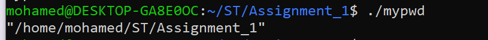
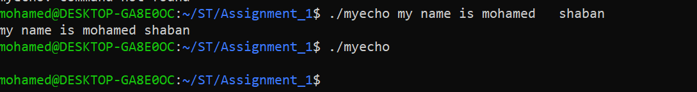
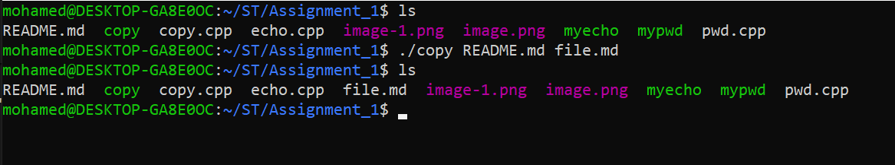
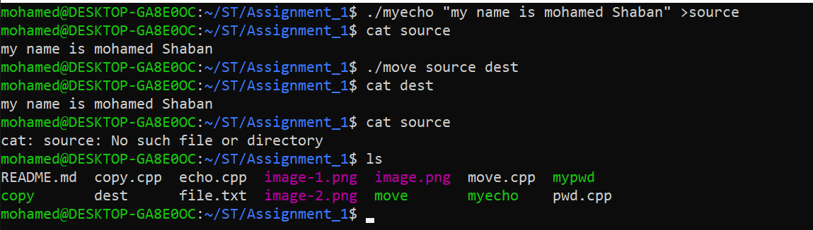

# ST Assignment

## Commands
- [pwd](#pwd Command)
- [echo](#echo Command)
- [cd](#cd Command)
- [mv](#mv Command)

### pwd Command
> print current directory using filesystem library suppor for cpp17 

**how to used**
```
./mypwd
```
**example**


### echo Command
> print a user input string on stdout


**how to used**
```
./myecho "user string"
```
**example**



### cd Command
>copy a file to another file and keep the original one.
if the dest is dir will copy source file with same name in this dir.

**how to used**
```
./copy (source) (dest)
```

**example**


### mv Command
>move a file to another file and remove the original one

**how to used**
```
./move (source) (dest)
```

**example**

